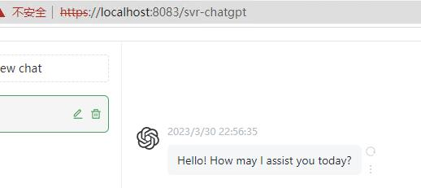
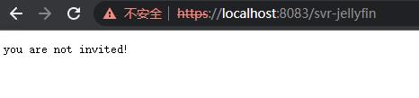
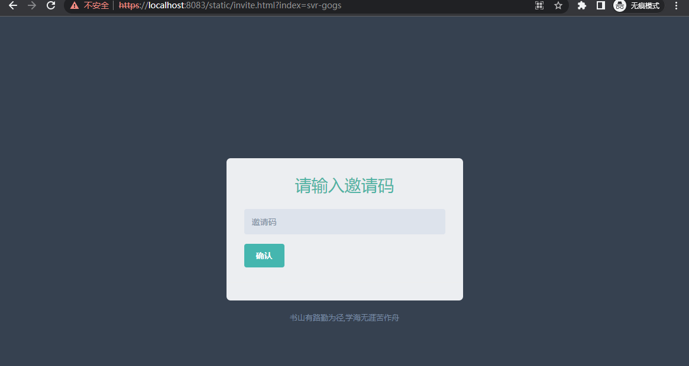

# my-gateway-demo5

项目仅供学习，因为可能有BUG

项目固定，除非改BUG，否则不再改变。

## 目标

- [x] 1.配置化
- [x] 2.安全性

yaml配置解析
redis集成

## 原理说明

1. 通过请求所附带的cookie判断属于哪个服务，然后反向代理到指定的服务
2. 通过iframe套`/`页面，然后通过上层页面去接收cookie，使得`/`页面的请求附带指定的cookie
3. 通过redis来做权限管理，用于需要通过页面`/invite.html?index=svr-gogs`来输入邀请码的功能，邀请码的格式是:`cxx-gogs_chatgpt`, cxx 是用户唯一标识，gogs_chatgpt是允许他访问两个服务
gogs和chatpgt。all表示所有服务都许可。
1. 邀请码验证成功之后，会增加相应的用户唯一标识到redis，`1-cxx-gogs_chatgpt`，日后用用户唯一标识来鉴别权限范围。
2. 使用命令增加邀请码：

```
sadd InviteCodesKey cxx-gogs_chatgpt
sadd AllowUserKey 0-me-all
```

6. cookie的过期时间是1年，但是会一直刷新，其实是永不过期
7. 邀请码校验成功后，会通过邀请码生成用户ID，这个ID写入redis，后续每个请求都会去redis里对比一下用户ID是否存在。以此来进行安全校验。

## 概述

我自己在写的一个网关，通过路径前缀，仅用一个端口将各式各样不同的服务开放出去。
再套上全局统一的邀请码，做安全验证。用途是，通过一个端口就开放自己所搭建过的所有web服务
适合只有一个端口出网，而且服务自己用的用户

config里的密钥私钥都是测试生成的，后续要自己替换自己的，免的有安全问题。

代码之所以不分模块的原因：太简单了，分了各种模块会很难改

## 安装

后续再补文档

## 邀请页

https://localhost:8083/static/invite.html?index=svr-gogs

参数index是邀请验证成功后的跳转路径

## 效果预览



---


---



---



